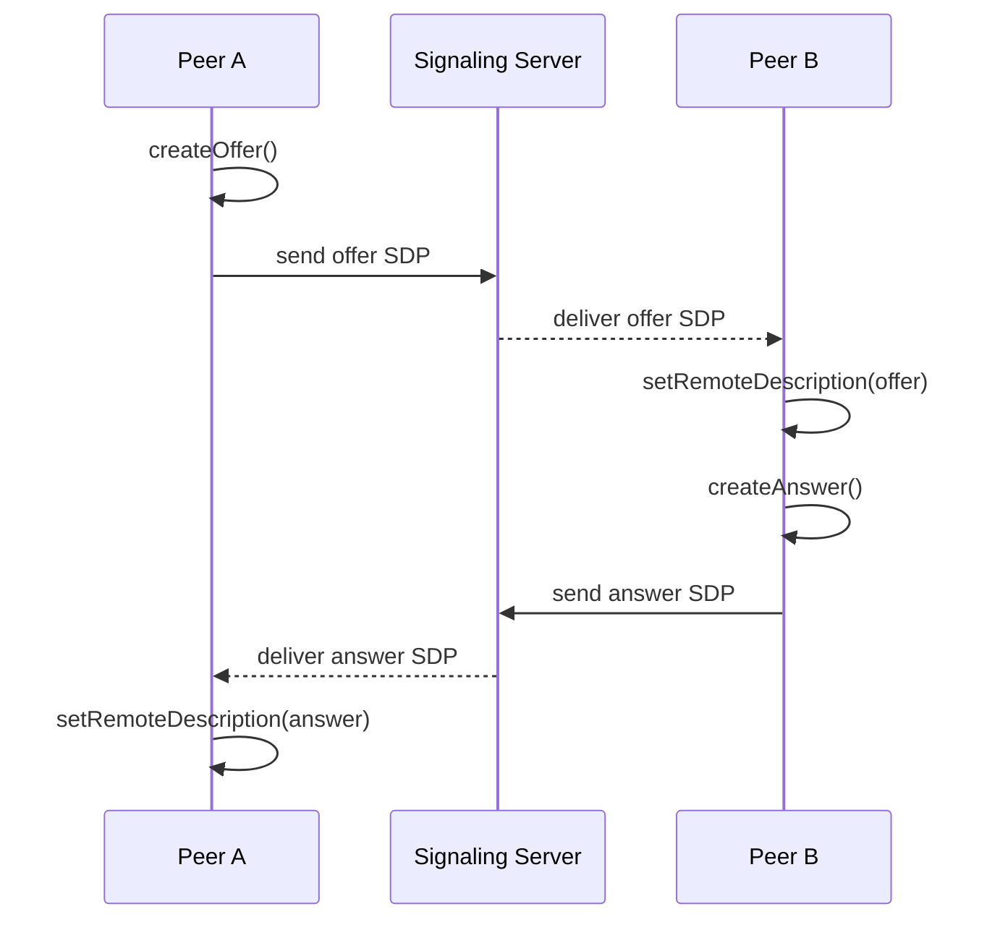
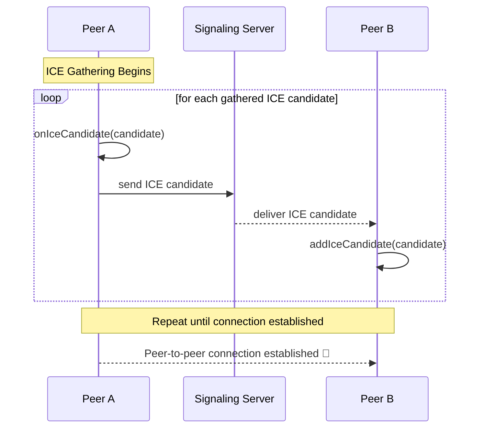

---
# You can also start simply with 'default'
theme: neversink
# random image from a curated Unsplash collection by Anthony
# like them? see https://unsplash.com/collections/94734566/slidev
background: https://cover.sli.dev
# some information about your slides (markdown enabled)
title: Welcome to Slidev
info: |
  ## Slidev Starter Template
  Presentation slides for developers.

  Learn more at [Sli.dev](https://sli.dev)
# https://sli.dev/features/drawing
drawings:
  persist: false
# slide transition: https://sli.dev/guide/animations.html#slide-transitions
transition: slide-left
# enable MDC Syntax: https://sli.dev/features/mdc
mdc: true

layout: intro
color: emerald-light

# open graph
# seoMeta:
#  ogImage: https://cover.sli.dev
---

# WebRTC realtime communication

by **Viktor Hőbör**

:: note ::

\* not including video audio streaming

<!--
The last comment block of each slide will be treated as slide notes. It will be visible and editable in Presenter Mode along with the slide. [Read more in the docs](https://sli.dev/guide/syntax.html#notes)
-->

---
layout: quote
color: sky-light
quotesize: text-m
authorsize: text-s
author: 'George Bernard Shaw'
---


"The single biggest problem in communication is the illusion that it has taken place."


---
layout: side-title
align: l
color: emerald-light
---

# Why WebRTC? And what is it?


:: title ::
<v-clicks>

- Save bandwidth for your application
- Have more resiliency
- Only way to udp in the browser (low latency)
- Encrypted by default
- Native in Chrome, Firefox, Safari, Edge.

</v-clicks>
---
layout: top-title-two-cols
color: emerald-light
---

:: title ::
# Wow such easy

:: left ::
Bob

```ts [bob-init.ts]  {all|2|4|5|all}{at:1} twoslash
  import { Peer } from 'peerjs';
  const peer = new Peer('bob');

  peer.on('connection', conn => {
    conn.on('data', data => {
      console.log('Received:', data); // 📨
    });
  });
```
<div v-click="'+4'" class="flex justify-center items-center w-full mt-10">
  
</div>


:: right ::

Alice
```ts [alice-init.ts]  {all|2|5|7|all}{at:1} twoslash
  import { Peer } from 'peerjs';
  const peer = new Peer('alice');

  peer.on('open', id => {
    const conn = peer.connect('bob');
    conn.on('open', () => {
      conn.send('Hello, from Alice! 👋');
    });
  });
```

<v-clicks depth="2" at="5" >

- Does this "just" work?
  - needs [peerjs-server](https://github.com/peers/peerjs-server) hosted
- Where are the proper [RTCPeerConenction](https://developer.mozilla.org/en-US/docs/Web/API/RTCPeerConnection) types?
  - [peerjs](https://github.com/peers/peerjs) is an extra abstraction to manage

</v-clicks>

---
layout: side-title
color: emerald-light
align: lm
---

:: title ::


:: content ::

```dart [loopback_data_channel_sample.dart] {all|1,2|4,5|21,22|29,35|30,31,36,37|33|all}{lines:true,maxHeight:'300px'}
_peerConnection1 = await createPeerConnection({'iceServers': []});
_peerConnection2 = await createPeerConnection({'iceServers': []});

_peerConnection1!.onIceCandidate = (c) => _peerConnection2!.addCandidate(c);
_peerConnection2!.onIceCandidate = (c) => _peerConnection1!.addCandidate(c);

_dataChannel1 = await _peerConnection1!.createDataChannel(
  'dc', RTCDataChannelInit()..id = 1,
);

_dataChannel1!.onMessage = (msg) {
  print('dataChannel1 received: ${msg.text}');
};

_dataChannel1!.onDataChannelState = (state) {
  if (state == RTCDataChannelState.RTCDataChannelOpen) {
    _dataChannel1!.send(RTCDataChannelMessage("Hello from dataChannel1!"));
  }
};

_peerConnection2!.onDataChannel = (channel) {
  _dataChannel2 = channel;
  _dataChannel2!.onMessage = (msg) {
    print('dataChannel2 received: ${msg.text}');
    _dataChannel2!.send(RTCDataChannelMessage("Echo: ${msg.text}"));
  };
};

var offer = await _peerConnection1!.createOffer();
await _peerConnection1!.setLocalDescription(offer);
await _peerConnection2!.setRemoteDescription(offer);

// There something seems to be missing here.

var answer = await _peerConnection2!.createAnswer();
await _peerConnection2!.setLocalDescription(answer);
await _peerConnection1!.setRemoteDescription(answer);
```
<v-clicks  at="1" >
<v-drag pos="100,10,200,_,-3">
  <div text-center text-3xl border border-main rounded>
      Ice servers?
  </div>
</v-drag>

<v-drag pos="84,98,268,_,3">
  <div text-center text-3xl border border-main rounded>
      Candidates?
  </div>
</v-drag>

<v-drag pos="400,380,268,_,2">
  <div text-center text-3xl border border-main rounded>
      Channel already created ?
  </div>
</v-drag>

<v-drag pos="702,444,268,_,-3">
  <div text-center text-3xl border border-main rounded>
      Offer, answer?
  </div>
</v-drag>

<v-drag pos="82,438,268,_">
  <div text-center text-3xl border border-main rounded>
      Descriptions
  </div>
</v-drag>
</v-clicks>

---
layout: default
---

# No magic, signaling instead


<span class="ns-c-quote">Establishing a WebRTC connection between two devices requires the use of a <span v-mark.underline.orange>signaling server</span>
 to resolve how to connect them over the internet. </span>
<span class="ns-c-cite" style="display:block; width:fit-content;margin-left:auto; margin-right:none;">[Mozilla docs](https://developer.mozilla.org/en-US/docs/Web/API/WebRTC_API/Signaling_and_video_calling#the_signaling_server)</span>

### Responsibilites of signaling server:
- <span v-mark.underline.orange>Transfer Session Description Protocol, SDP</span> values
  - What media types are supported (audio, video, data)
  - Which codecs to use (VP8, Opus, etc.)
- Transfer <span v-mark.underline.orange>Candidates</span> between peers
   - the network adresses where peer is available
   - may be embedded into SDP, or if trickle is enabled (default=true), then sent separately
- Facilitate the initial connection flow <span v-mark.underline.orange>(offer, answer flow)</span>

---
layout: top-title-two-cols
color: emerald-light
---

::title::
# Signaling flow

:: left ::
1

:: right ::
2


---
layout: top-title-two-cols
color: green-light
---

:: title ::
# Transfer Session Description Protocol (SDP)

:: left ::
``` {all|1|2|3|4|5|6|7|8|9|10|11,12|all}{lines:true}
v=0
o=jdoe 2890844526 2890842807 IN IP4 10.47.16.5
s=SDP Seminar
i=A Seminar on the session description protocol
u=http://www.example.com/seminars/sdp.pdf
e=j.doe@example.com (Jane Doe)
c=IN IP4 224.2.17.12/127
t=2873397496 2873404696
a=recvonly
m=audio 49170 RTP/AVP 0
m=video 51372 RTP/AVP 99
a=rtpmap:99 h263-1998/90000
```


:: right ::
<div class="ns-c-tight">
<v-clicks at="1">

- Version of SDP
- Origin line. Who created the session. Set by library.
- Session name. Required.
- Session info. Optional.
- URI for more info about the session.
- Email contact of the session originator.
- Connection information: IP, type. Multicast or unicast.
- Timing of the session in NTP time.
- Attribute: recvonly = only receives media
- Media: audio stream. Port, protocol, and codec.


</v-clicks>
<v-click at="11">

- Media: video stream codec defined below (99).
- Payload type 99 is mapped to H263 codec at 90kHz.

</v-click>
</div>

---
layout: side-title
side: r
color: blue-light
titlewidth: is-6
align: lm-lb
title: Side Title Layout (Another)
---

:: title ::


# <mdi-arrow-left /> ICE Candidates

:: content ::
<v-click at='1'>
<Admonition title="Problem" color='blue-light' width="100%">
Not everybody has open ports on the internet. Most routers use NAT to use a single public ip for multiple clients. Also blocking incoming traffic.
</Admonition>
<div class="pt-5"></div>
</v-click>

<v-click at='2'>

We need [NAT traversal](https://tailscale.com/blog/how-nat-traversal-works) or relay.


| STUN                      | TURN                      |
|----------------------------|------------------------------|
| Finds your public IP       | Relays data through a server |
| Used for direct P2P        | Used when P2P fails          |
| Low bandwidth              | High bandwidth               |

</v-click>

<div class="pt-[40px]"></div>

<v-click at='3'>

```
candidate:2 1 UDP 1694498815 192.0.2.3 45664 typ srflx raddr
   10.0.1.1 rport 8998
```
<span class="font-size-sm ns-c-cite mt-4">

</span>
</v-click>


---
layout: top-title-two-cols
color: teal-light
---

:: title ::
# Practical signaling implemetation over Supabase

:: left ::

##### Rooms
<div class="text-size-sm line-height-snug ">
Browsers can only handle a limited amount of WebRTC connections at a time so it's recommended to design your app such that users are divided into groups.
<span class="ns-c-cite text-size-xs line-height-snug" >

[Trystero](https://github.com/dmotz/trystero/tree/main#how-it-works)

</span>
</div>


<span class="text-size-sm ">

Supabase has a product called [realtime](https://supabase.com/realtime) which allows for creating such rooms mentioned above and works over websockets.

<v-clicks>

- [Channels](https://supabase.com/docs/guides/realtime/concepts) <mdi-arrow-right /> will be our room implementations, each room will have a unique channel name, and users can join when subscribing to events in the room
- Users will get notifications via [Presence](https://supabase.com/docs/guides/realtime/presence?queryGroups=language&language=dart) if someone joins the room they are in
- Signaling will be routed to users in the room via broadcast message and message type

</v-clicks>
</span>

:: right ::
```dart {none|1|8-18|2-7|all}{lines:true, at:1}
client.channel('signaling_$roomid')
  .onBroadcast(
    event: 'to_$userId',
    callback: (payload) {
      // ...
    },
  )
  .onPresenceJoin((payload) {
    final joinedId = payload.newPresences.first.payload['id'];
    // ...
  })
  .onPresenceLeave((payload) {
    // ...
  })
  .subscribe((status, error) {
    if (status == RealtimeSubscribeStatus.subscribed) {
      channel.track({'id': userId});
    }
});
```

---
layout: two-cols-title
color: teal
---
:: title ::
# Demo time

:: left ::
https://flutter-webrtc.pages.dev/
<QRCode value="https://flutter-webrtc.pages.dev/" :size="200" render-as="svg"/>

:: right ::
Android apk
<QRCode value="https://drive.google.com/file/d/1gtn5VghMZoEh_dFA1f_1OwR3rxTdBFC4/view?usp=drivesdk" :size="200" render-as="svg"/>

---
layout: two-cols-title
color: teal-light
---

:: title ::
# etc ...

:: left ::

#### Chat
- This is not enough for a chat application:
  - Both users have to be online, and looking at their screens for this to work
  - Offline messaging has to be solved

#### Signaling over not a "server"

  - It is possible to signal over publicly available infrastructure see [Trystero](https://github.com/dmotz/trystero/tree/main)
    - WebTorrent trackers
    - Public mqtt servers

:: right ::
<span class="ns-c-cite">

#### References
- https://github.com/dmotz/trystero/tree/main
- https://developer.mozilla.org/en-US/docs/Web/API/WebRTC_API
- https://github.com/flutter-webrtc/flutter-webrtc/blob/main/example/lib/src/loopback_data_channel_sample.dart
- https://sli.dev/

</span>

<div v-click="'+1'" class="flex justify-center items-center w-full mt-10">
  
</div>
